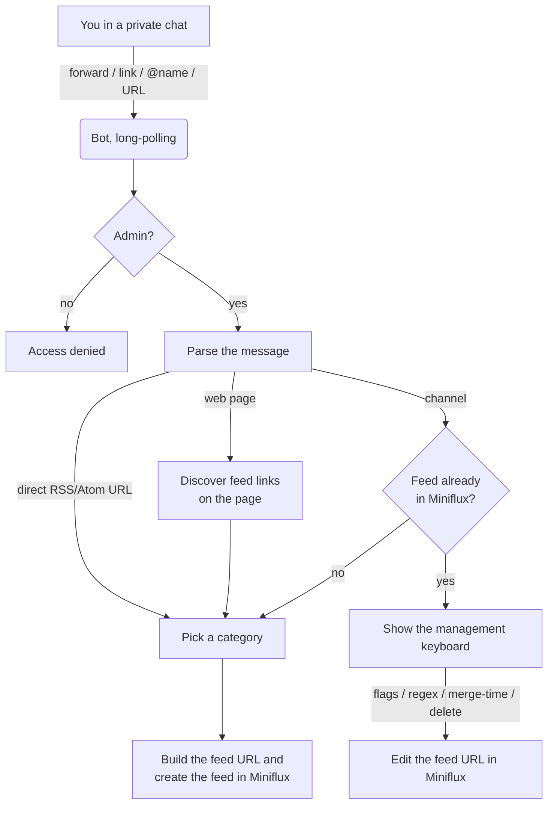

# miniflux-tg-add-bot

[English](README.md) · [Русский](README.ru.md)

A Telegram bot that subscribes Telegram channels, RSS/Atom feeds and web pages to a
self-hosted [Miniflux](https://miniflux.app/) instance — forward a post (or send a link),
pick a category, done. It also lets you tune each channel feed afterwards: exclusion flags,
an exclude-regex, a merge-time window, or delete it.

Telegram channels have no native RSS, so the bot turns a channel into a feed through an
external **RSS-Bridge** (e.g. [pyrogram-bridge](https://github.com/vvzvlad/pyrogram-bridge)
or [RSSHub](https://github.com/DIYgod/RSSHub)) and registers the resulting URL in Miniflux
over the Miniflux API. It runs in **polling mode**: no inbound port, no public hostname,
no webhook.

---

## How it works



The pieces:

- **Telegram** — the bot talks to Telegram in long-polling mode via
  [`python-telegram-bot`](https://github.com/python-telegram-bot/python-telegram-bot).
  Only private-chat messages are handled, and only from the one username in `ADMIN`
  (everyone else gets *Access denied*).
- **RSS-Bridge** — a channel has no RSS, so the bot inserts the channel name into your
  `RSS_BRIDGE_URL` template (in place of `{channel}`) to get a feed URL. Feed options
  (flags, regex, merge-time) are encoded as query parameters on that URL.
- **Miniflux** — the bot calls the Miniflux API (with an API key or username/password) to
  list categories, check for duplicates, create feeds, edit feed URLs and delete feeds.
  Miniflux is the single source of truth — the bot keeps no database of its own.

Everything the bot does at runtime is an API call to Miniflux or an HTTP request to the
RSS-Bridge/target site; **all of them are wrapped in `asyncio.to_thread`** so the single
polling loop is never blocked while a request is in flight.

### The message pipeline

Every private message goes through `handle_message`:

1. **Admin gate** — non-admins are refused immediately.
2. **State check** — if the bot previously asked you for a *regex* or a *merge-time* (see
   [management](#managing-an-existing-feed)), your next text message is consumed as that
   answer instead of being parsed as a new subscription.
3. **Media-group de-duplication** — an album (media group) fires several messages; only the
   first is processed, the rest are ignored.
4. **Content detection** (`_parse_message_content`) recognises, in order:
   - a **forwarded post** from a channel → the channel's `@username` (or numeric id);
   - a bare **`@username`**;
   - a **`t.me/…` link** — including links embedded in a sentence, with a trailing
     `?query`/`#fragment`, and the private-channel `t.me/c/<id>/<msg>` form;
   - a **direct RSS/Atom URL** (verified with a `HEAD`, then a `GET`);
   - an **HTML page** — the bot parses `<link rel="alternate" type="application/rss+xml">`
     tags and offers whatever feeds it finds.
5. **Routing** — the detected item is handed to the matching handler, which either shows the
   management keyboard (if the feed already exists) or the category picker (to subscribe).

### Subscribing

When you subscribe a channel, the bot fetches your Miniflux categories and shows them as
inline buttons. You tap one; the bot substitutes the channel into the `{channel}` slot of
`RSS_BRIDGE_URL`, creates the feed in that category, and reports the result. A direct RSS
URL or a feed discovered on a web page follows the same category-picking flow.

Before subscribing a channel the bot checks whether it is already in Miniflux (by parsing
the channel name back out of every existing feed URL). If it is, you get the management
keyboard instead of a duplicate.

### Managing an existing feed

Sending an already-subscribed channel (or reaching it another way) shows a keyboard that
edits the feed **URL** in Miniflux:

- **Flags** — the bot asks the RSS-Bridge for the list of supported flags and renders one
  toggle button per flag (`✅ Add "x"` / `❌ Remove "x"`). Toggling rewrites the
  `exclude_flags` query parameter. The flag list is cached briefly so a burst of taps does
  not hammer the bridge; if the bridge is unreachable the flag buttons are hidden and a note
  is shown (the bot never invents a flag).
- **Edit Regex** — the bot asks for a regex and stores it as the `exclude_text` parameter;
  Miniflux then drops entries matching it. Send `-` to clear it.
- **Edit Merge Time** — a `merge_seconds` window (entries closer together than this are
  merged). Send `0` to disable.
- **Delete channel** — removes the feed from Miniflux.

The regex and merge-time editors are stateful: the bot remembers it is waiting for your
answer, and if you type something invalid it tells you and keeps waiting rather than losing
your place.

### The feed URL format

The bot builds and parses feed URLs of this shape:

```text
<RSS_BRIDGE_URL with {channel} replaced>?exclude_flags=a,b&exclude_text=<regex>&merge_seconds=<n>
```

- `exclude_flags` — comma-separated flag names (bridge-specific).
- `exclude_text` — URL-encoded regex; matching entries are excluded.
- `merge_seconds` — integer; merge window in seconds.

Parsing is symmetric with building, so editing one option never disturbs the others.

## Commands

| Command | What it does |
| --- | --- |
| `/start` | Short usage help. |
| `/list`  | All current subscriptions, grouped by Miniflux category, with each feed's flags and regex. Long categories are split across several messages to stay under Telegram's 4096-char limit. |

Everything else is driven by forwarding/sending content and tapping inline buttons.

## Configuration

All configuration comes from environment variables (or a local `.env`). Configuration is
validated at startup by [pydantic-settings](https://docs.pydantic.dev/latest/concepts/pydantic_settings/):
a missing or invalid variable stops the bot immediately with a readable message naming the
variable — never a silent half-broken start.

| Variable | Required | Default | Description |
| --- | --- | --- | --- |
| `TELEGRAM_TOKEN` | yes | — | Bot token from [@BotFather](https://t.me/BotFather). |
| `MINIFLUX_BASE_URL` | yes | — | URL of your Miniflux instance, e.g. `http://miniflux.example.com`. |
| `MINIFLUX_API_KEY` | one of | — | Miniflux API key… |
| `MINIFLUX_USERNAME` | one of | — | …or Miniflux username + password. |
| `MINIFLUX_PASSWORD` | one of | — | Password for `MINIFLUX_USERNAME`. |
| `RSS_BRIDGE_URL` | yes | — | RSS-Bridge feed template; **must contain `{channel}`**, e.g. `http://bridge.example.com/rss/{channel}`. |
| `ADMIN` | yes | — | The one Telegram username allowed to use the bot (compared exactly, without the leading `@`). |
| `TELEGRAM_API_SERVER` | no | public API | Optional self-hosted Telegram Bot API server root, used when `api.telegram.org` is not directly reachable, e.g. `http://internal.lc:8081` (the bot appends `/bot` and `/file/bot`). |
| `ACCEPT_CHANNELS_WITHOUT_USERNAME` | no | `false` | Allow subscribing channels that have no public username (the bridge must support it; RSSHub does not). |
| `LOG_LEVEL` | no | `INFO` | Logging level. |

Authenticate against Miniflux with **either** `MINIFLUX_API_KEY` **or**
`MINIFLUX_USERNAME` + `MINIFLUX_PASSWORD`. There are no default credentials and no default
addresses for your own services — those must be supplied.

## Project layout

```text
main.py                  # thin entry point: configure logging, then run the bot
src/
├── settings.py          # pydantic-settings — the single config entry point (fail-fast)
├── config_errors.py     # turns a validation error into a clear message + exit(1)
├── bot.py               # builds the Application, registers handlers + the error handler
├── miniflux_api.py      # Miniflux client (get_client) and the API calls
├── url_utils.py         # parse t.me links, detect RSS/HTML, extract channel from a feed URL
├── url_constructor.py   # parse/build the RSS-Bridge feed URL and its query parameters
└── handlers/
    ├── commands.py      # /start, /list
    ├── messages.py      # message parsing, routing, the regex/merge-time state machine
    ├── callbacks.py     # inline-button callbacks (category, flags, regex, merge, delete)
    ├── keyboards.py     # category and flag keyboards, cached flag fetching
    └── common.py        # admin guard, safe message editing
tests/                   # pytest suite
data/                    # runtime state (gitignored, mounted as a docker volume)
```

## Local development

Everything routine is a `Makefile` target (`make help` lists them all):

```bash
make install    # create .venv and install dev/test dependencies
make env        # copy .env.example -> .env, then fill in the values
make test       # run the pytest suite
make run        # run the bot
```

`make test` / `make run` create and reuse a local `.venv` automatically — the system Python
is never used.

## Tests

The suite (`pytest`) covers the URL parsing/building, the Miniflux API wrappers, message
parsing, the inline-button callbacks and the config validation, and carries regression tests
for the reliability bugs fixed in the refactor. The Miniflux client is mocked as a
**synchronous** object (it really is synchronous), so any accidental `await` on a client
call fails the test loudly. In CI, the image is only built after the tests pass.

## Deployment

The image is built and pushed to `ghcr.io` by GitHub Actions on every push to `master`
(the test job must be green first) and is **never built on the server**. Deploy it with the
provided [`docker-compose.yml`](docker-compose.yml):

```bash
docker compose up -d
```

Fill in the `environment:` block (the committed values are placeholders) using the table
above. [Watchtower](https://github.com/containrrr/watchtower) picks up new `:latest` images
automatically (the compose file already carries the watchtower label), so a push to `master`
ends up deployed without touching the server.

Runtime state lives in `/app/data` inside the container, backed by the named volume declared
in the compose file, so it survives restarts and image updates.
