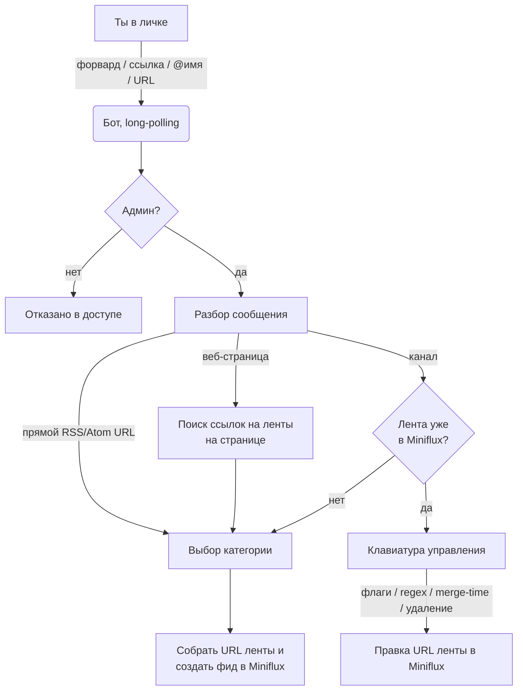

# miniflux-tg-add-bot

[English](README.md) · [Русский](README.ru.md)

Телеграм-бот, который подписывает Telegram-каналы, RSS/Atom-ленты и веб-страницы в
развёрнутый у себя [Miniflux](https://miniflux.app/): пересылаешь пост (или кидаешь ссылку),
выбираешь категорию — готово. Плюс к этому у каждого канала-ленты можно потом настроить
флаги-исключения, regex-фильтр, окно склейки (merge-time) или удалить её.

У Telegram-каналов нет своего RSS, поэтому бот превращает канал в ленту через внешний
**RSS-Bridge** (например, [pyrogram-bridge](https://github.com/vvzvlad/pyrogram-bridge)
или [RSSHub](https://github.com/DIYgod/RSSHub)) и регистрирует получившийся URL в Miniflux
через Miniflux API. Работает в режиме **polling**: без входящего порта, без публичного
хоста, без вебхуков.

---

## Как это работает



Из чего всё состоит:

- **Telegram** — бот общается с Telegram по long-polling через
  [`python-telegram-bot`](https://github.com/python-telegram-bot/python-telegram-bot).
  Обрабатываются только сообщения из лички и только от единственного юзернейма из `ADMIN`
  (всем остальным — *Access denied*).
- **RSS-Bridge** — у канала нет RSS, поэтому бот подставляет имя канала в твой шаблон
  `RSS_BRIDGE_URL` (вместо `{channel}`) и получает URL ленты. Опции ленты (флаги, regex,
  merge-time) кодируются query-параметрами этого URL.
- **Miniflux** — бот дёргает Miniflux API (по API-ключу или логину/паролю): список
  категорий, проверка дублей, создание лент, правка URL ленты, удаление. Miniflux —
  единственный источник правды, своей БД бот не держит.

Всё, что бот делает в рантайме, — это вызов Miniflux API или HTTP-запрос к
RSS-Bridge/сайту; **все они завёрнуты в `asyncio.to_thread`**, чтобы единственный
polling-цикл не блокировался, пока запрос в полёте.

### Конвейер обработки сообщения

Каждое сообщение из лички проходит через `handle_message`:

1. **Проверка админа** — не-админам сразу отказ.
2. **Проверка состояния** — если бот ранее попросил *regex* или *merge-time* (см.
   [управление](#управление-существующей-лентой)), твоё следующее текстовое сообщение
   уходит как ответ на этот вопрос, а не разбирается как новая подписка.
3. **Дедупликация медиагруппы** — альбом порождает несколько сообщений; обрабатывается
   только первое, остальные игнорируются.
4. **Определение содержимого** (`_parse_message_content`) распознаёт по порядку:
   - **форвард** из канала → `@username` канала (или числовой id);
   - голый **`@username`**;
   - **ссылку `t.me/…`** — в том числе внутри предложения, с хвостом `?query`/`#fragment`
     и приватную форму `t.me/c/<id>/<msg>`;
   - **прямой RSS/Atom URL** (проверяется через `HEAD`, затем `GET`);
   - **HTML-страницу** — бот парсит теги
     `<link rel="alternate" type="application/rss+xml">` и предлагает найденные ленты.
5. **Маршрутизация** — найденное отдаётся нужному обработчику, который показывает либо
   клавиатуру управления (если лента уже есть), либо выбор категории (чтобы подписать).

### Подписка

Когда подписываешь канал, бот запрашивает твои категории в Miniflux и показывает их
кнопками. Жмёшь одну — бот подставляет канал в слот `{channel}` шаблона `RSS_BRIDGE_URL`,
создаёт ленту в этой категории и рапортует результат. Прямой RSS-URL или лента, найденная
на веб-странице, идут по тому же пути с выбором категории.

Перед подпиской канала бот проверяет, нет ли его уже в Miniflux (выпарсивая имя канала
обратно из URL каждой существующей ленты). Если есть — вместо дубля показывается клавиатура
управления.

### Управление существующей лентой

Если прислать уже подписанный канал (или дойти до него иначе), показывается клавиатура,
которая правит **URL** ленты в Miniflux:

- **Флаги** — бот спрашивает у RSS-Bridge список поддерживаемых флагов и рисует по кнопке
  на каждый (`✅ Add "x"` / `❌ Remove "x"`). Переключение переписывает query-параметр
  `exclude_flags`. Список флагов ненадолго кэшируется, чтобы серия нажатий не долбила
  бридж; если бридж недоступен — кнопки флагов скрываются и показывается пометка (бот
  никогда не выдумывает флаг).
- **Edit Regex** — бот просит regex и кладёт его в параметр `exclude_text`; Miniflux
  отбрасывает подходящие записи. `-` очищает.
- **Edit Merge Time** — окно `merge_seconds` (записи ближе этого по времени склеиваются).
  `0` отключает.
- **Delete channel** — удаляет ленту из Miniflux.

Редакторы regex и merge-time — с состоянием: бот помнит, что ждёт твой ответ, и при
некорректном вводе сообщает об этом и продолжает ждать, а не теряет контекст.

### Формат URL ленты

Бот собирает и разбирает URL лент такого вида:

```text
<RSS_BRIDGE_URL с подставленным {channel}>?exclude_flags=a,b&exclude_text=<regex>&merge_seconds=<n>
```

- `exclude_flags` — имена флагов через запятую (зависят от бриджа).
- `exclude_text` — URL-кодированный regex; подходящие записи исключаются.
- `merge_seconds` — целое; окно склейки в секундах.

Разбор симметричен сборке, поэтому правка одной опции не задевает остальные.

## Команды

| Команда | Что делает |
| --- | --- |
| `/start` | Короткая справка. |
| `/list` | Все текущие подписки, сгруппированные по категориям Miniflux, с флагами и regex каждой ленты. Длинные категории разбиваются на несколько сообщений, чтобы влезть в лимит Telegram (4096 символов). |

Всё остальное — пересылкой/отправкой контента и нажатием инлайн-кнопок.

## Конфигурация

Вся конфигурация — из переменных окружения (или локального `.env`). Она проверяется на
старте через [pydantic-settings](https://docs.pydantic.dev/latest/concepts/pydantic_settings/):
отсутствующая или невалидная переменная сразу останавливает бота с понятным сообщением, где
названа переменная, — никакого тихого старта «наполовину сломанным».

| Переменная | Обязательна | По умолчанию | Описание |
| --- | --- | --- | --- |
| `TELEGRAM_TOKEN` | да | — | Токен бота от [@BotFather](https://t.me/BotFather). |
| `MINIFLUX_BASE_URL` | да | — | URL твоего Miniflux, напр. `http://miniflux.example.com`. |
| `MINIFLUX_API_KEY` | одно из | — | API-ключ Miniflux… |
| `MINIFLUX_USERNAME` | одно из | — | …или логин Miniflux + пароль. |
| `MINIFLUX_PASSWORD` | одно из | — | Пароль к `MINIFLUX_USERNAME`. |
| `RSS_BRIDGE_URL` | да | — | Шаблон ленты RSS-Bridge; **обязан содержать `{channel}`**, напр. `http://bridge.example.com/rss/{channel}`. |
| `ADMIN` | да | — | Единственный Telegram-юзернейм, которому можно пользоваться ботом (сравнивается точно, без ведущего `@`). |
| `TELEGRAM_API_SERVER` | нет | публичный API | Необязательный корень своего Telegram Bot API-сервера, когда `api.telegram.org` недоступен напрямую, напр. `http://internal.lc:8081` (бот сам дописывает `/bot` и `/file/bot`). |
| `ACCEPT_CHANNELS_WITHOUT_USERNAME` | нет | `false` | Разрешить подписку каналов без публичного юзернейма (бридж должен это уметь; RSSHub не умеет). |
| `LOG_LEVEL` | нет | `INFO` | Уровень логирования. |

Авторизация в Miniflux — **либо** `MINIFLUX_API_KEY`, **либо** `MINIFLUX_USERNAME` +
`MINIFLUX_PASSWORD`. Дефолтных кред нет, дефолтных адресов для своих сервисов тоже — их надо
задать.

## Структура проекта

```text
main.py                  # тонкая точка входа: настроить логи и запустить бота
src/
├── settings.py          # pydantic-settings — единая точка конфига (fail-fast)
├── config_errors.py     # превращает ошибку валидации в понятное сообщение + exit(1)
├── bot.py               # собирает Application, регистрирует хендлеры и error handler
├── miniflux_api.py      # клиент Miniflux (get_client) и вызовы API
├── url_utils.py         # разбор t.me-ссылок, детект RSS/HTML, извлечение канала из URL
├── url_constructor.py   # разбор/сборка URL ленты RSS-Bridge и его query-параметров
└── handlers/
    ├── commands.py      # /start, /list
    ├── messages.py      # разбор сообщений, маршрутизация, стейт-машина regex/merge-time
    ├── callbacks.py     # колбэки инлайн-кнопок (категория, флаги, regex, merge, удаление)
    ├── keyboards.py     # клавиатуры категорий и флагов, кэшируемый запрос флагов
    └── common.py        # гвард админа, безопасное редактирование сообщений
tests/                   # тесты pytest
data/                    # рантайм-стейт (в .gitignore, монтируется как docker-volume)
```

## Локальная разработка

Вся рутина — таргеты `Makefile` (`make help` покажет список):

```bash
make install    # создать .venv и поставить dev/test-зависимости
make env        # скопировать .env.example -> .env и заполнить значения
make test       # прогнать тесты pytest
make run        # запустить бота
```

`make test` / `make run` сами создают и переиспользуют локальный `.venv` — системный Python
не трогается.

## Тесты

Набор (`pytest`) покрывает разбор/сборку URL, обёртки Miniflux API, разбор сообщений,
колбэки инлайн-кнопок и валидацию конфига, плюс несёт регресс-тесты на баги надёжности,
исправленные в рефакторинге. Клиент Miniflux мокается как **синхронный** объект (он и правда
синхронный), поэтому случайный `await` на вызове клиента громко валит тест. В CI образ
собирается только после прохождения тестов.

## Деплой

Образ собирается и пушится в `ghcr.io` через GitHub Actions на каждый пуш в `master`
(сначала должен позеленеть джоб тестов) и **никогда не собирается на сервере**. Разворачивай
приложенным [`docker-compose.yml`](docker-compose.yml):

```bash
docker compose up -d
```

Заполни блок `environment:` (закоммиченные значения — плейсхолдеры) по таблице выше.
[Watchtower](https://github.com/containrrr/watchtower) сам подхватывает новый образ `:latest`
(лейбл watchtower уже в compose-файле), так что пуш в `master` доезжает до прода без захода
на сервер.

Рантайм-стейт лежит в `/app/data` внутри контейнера на именованном volume из compose-файла,
поэтому переживает рестарты и обновления образа.
